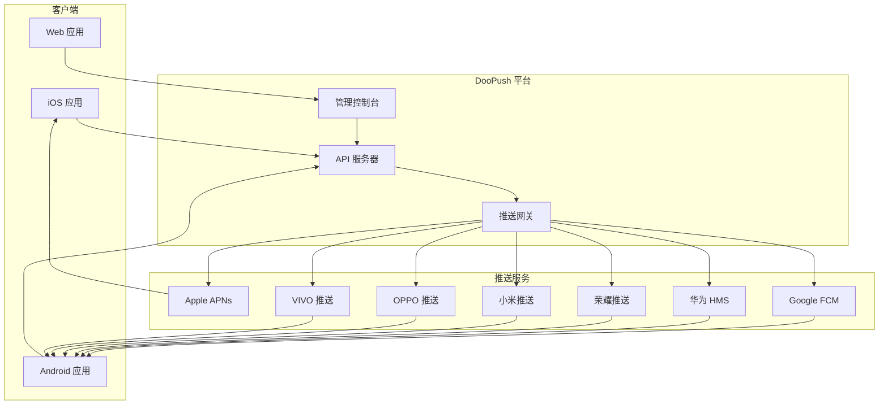
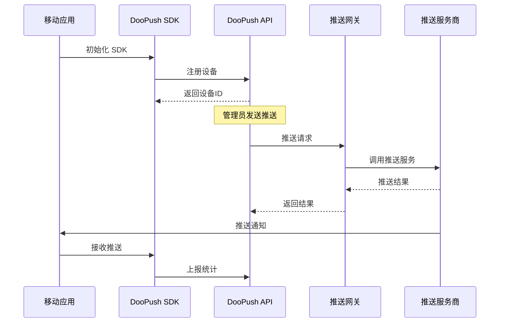
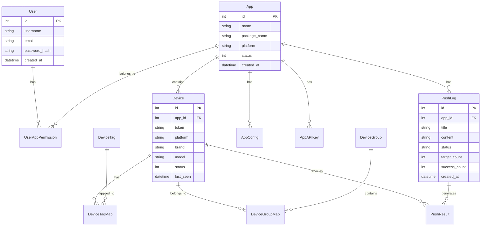
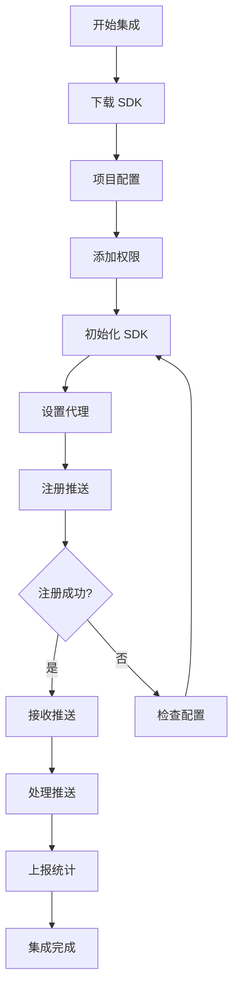
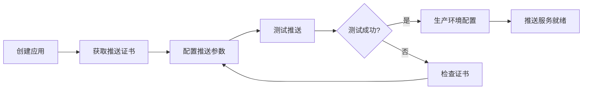

# DooPush 架构图

本文件包含 DooPush 系统的各种架构图和流程图的 Mermaid 源码。

## 系统整体架构

```mermaid
graph TB
    subgraph "客户端"
        iOS[iOS 应用]
        Android[Android 应用]
        Web[Web 应用]
    end
    
    subgraph "DooPush 平台"
        API[API 服务器]
        Console[管理控制台]
        Gateway[推送网关]
    end
    
    subgraph "推送服务"
        APNs[Apple APNs]
        FCM[Google FCM]
        HMS[华为 HMS]
        Honor[荣耀推送]
        MIUI[小米推送]
        OPPO[OPPO 推送]
        VIVO[VIVO 推送]
    end
    
    iOS --> API
    Android --> API
    Web --> Console
    
    API --> Gateway
    Console --> API
    
    Gateway --> APNs
    Gateway --> FCM
    Gateway --> HMS
    Gateway --> Honor
    Gateway --> MIUI
    Gateway --> OPPO
    Gateway --> VIVO
    
    APNs --> iOS
    FCM --> Android
    HMS --> Android
    Honor --> Android
    MIUI --> Android
    OPPO --> Android
    VIVO --> Android
```

## 推送流程图

```mermaid
sequenceDiagram
    participant App as 移动应用
    participant SDK as DooPush SDK
    participant API as DooPush API
    participant Gateway as 推送网关
    participant Provider as 推送服务商
    
    App->>SDK: 初始化 SDK
    SDK->>API: 注册设备
    API-->>SDK: 返回设备ID
    
    Note over API: 管理员发送推送
    API->>Gateway: 推送请求
    Gateway->>Provider: 调用推送服务
    Provider-->>Gateway: 推送结果
    Gateway-->>API: 返回结果
    
    Provider->>App: 推送通知
    App->>SDK: 接收推送
    SDK->>API: 上报统计
```

## 数据层次结构

```mermaid
erDiagram
    User ||--o{ UserAppPermission : has
    App ||--o{ UserAppPermission : belongs_to
    App ||--o{ Device : contains
    App ||--o{ PushLog : has
    App ||--o{ AppConfig : has
    App ||--o{ AppAPIKey : has
    
    Device ||--o{ DeviceTagMap : has
    Device ||--o{ DeviceGroupMap : belongs_to
    Device ||--o{ PushResult : receives
    
    DeviceGroup ||--o{ DeviceGroupMap : contains
    DeviceTag ||--o{ DeviceTagMap : applied_to
    
    PushLog ||--o{ PushResult : generates
    
    User {
        int id PK
        string username
        string email
        string password_hash
        datetime created_at
    }
    
    App {
        int id PK
        string name
        string package_name
        string platform
        int status
        datetime created_at
    }
    
    Device {
        int id PK
        int app_id FK
        string token
        string platform
        string brand
        string model
        int status
        datetime last_seen
    }
    
    PushLog {
        int id PK
        int app_id FK
        string title
        string content
        string status
        int target_count
        int success_count
        datetime created_at
    }
```

## SDK 集成流程

```mermaid
flowchart TD
    A[开始集成] --> B[下载 SDK]
    B --> C[项目配置]
    C --> D[添加权限]
    D --> E[初始化 SDK]
    E --> F[设置代理]
    F --> G[注册推送]
    G --> H{注册成功?}
    H -->|是| I[接收推送]
    H -->|否| J[检查配置]
    J --> E
    I --> K[处理推送]
    K --> L[上报统计]
    L --> M[集成完成]
```

## 推送配置流程

```mermaid
graph LR
    A[创建应用] --> B[获取推送证书]
    B --> C[配置推送参数]
    C --> D[测试推送]
    D --> E{测试成功?}
    E -->|是| F[生产环境配置]
    E -->|否| G[检查证书]
    G --> C
    F --> H[推送服务就绪]
```
